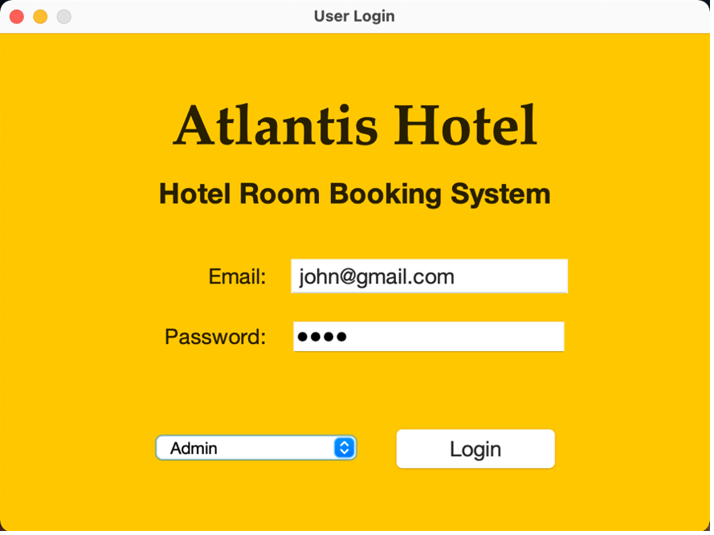
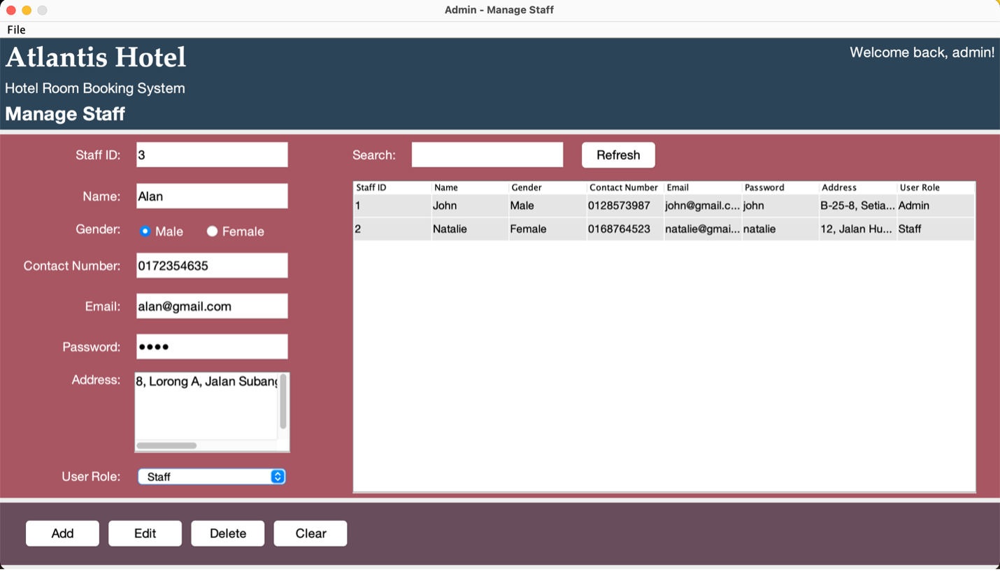
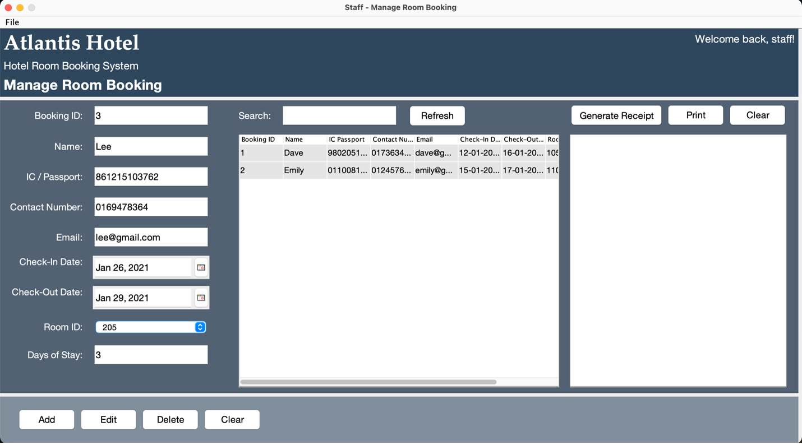

# Hotel Room Booking System
The Atlantis Hotel Room Booking System is a desktop application developed using Java. The interface is designed using Java Swing GUI widget toolkit. Data processing I/O is done using text files.

 

## Features
* Login authentication
* Manage staff account
* Manage room booking
* Date selection
* Generate & print booking receipt

 

## Screenshots
### All Users
#### User Login

 

### Admin
#### Manage Staff Account

 

### Staff
#### Manage Room Booking

